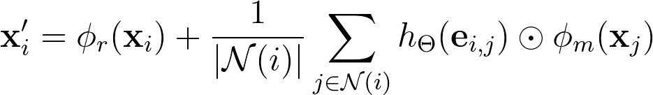

# SeqConv

`SeqConv` is a PyTorch implementation of a graph convolutional operator that uses long short-term memory (LSTM) to update node embeddings. This is useful for graph datasets where each node represents a sequence, such as a time series.

<p align="center">
    
</p>

Where _&phi;<sub>r</sub>_ and _&phi;<sub>m</sub>_ are LSTMs ([`torch.nn.LSTM`](https://pytorch.org/docs/stable/nn.html#torch.nn.LSTM)), and _h<sub>Θ</sub>_ is a neural network. The outputs of each LSTM are the last hidden state, _h<sub>n</sub>_, rather than all the output features.

## Installation

This module can be installed with `pip`:

```bash
$ pip install seq_conv
```

## Usage

`SeqConv` is built on PyTorch Geometric and derives from the [`MessagePassing`](https://pytorch-geometric.readthedocs.io/en/latest/modules/nn.html#torch_geometric.nn.conv.message_passing.MessagePassing) class. It expects an input graph where each node's "features" is a sequence of vectors. `SeqConv`, similarly to [`NNConv`](https://pytorch-geometric.readthedocs.io/en/latest/modules/nn.html#torch_geometric.nn.conv.NNConv), also incorporates any available edge features when collecting messages from a node's neighbors.

**Parameters:**

- **in_channels** (_int_): Number of channels in the input node sequence (e.g. if each node has a sequence of vectors of size n associated with it, then in_channels = n)
- **out_channels** (_int_): Number of channels in the output node embedding
- **edge_nn** (_torch.nn.Module_): A neural network _h<sub>Θ</sub>_ that maps edge features, `edge_attr`, of shape `[-1, num_edge_features]` to shape `[-1, out_channels]`
- **aggr** (_string_, _optional_): The message aggregation scheme to use ("add", "mean", "max")
- **root_lstm** (_bool_, _optional_): If set to `False`, the layer will not add the LSTM-transformed root node features to the output
- **bias** (_bool_, _optional_): If set to `False`, the layer will not learn an additive bias
- **\*\*kwargs** (_optional_): Additional arguments for `torch.nn.LSTM`

**Example Usage:**

```python
import torch
from seq_conv import SeqConv

# Convolutional layer
conv_layer = SeqConv(
    in_channels=1,
    out_channels=5,
    edge_nn=torch.nn.Linear(2, 5)
)

# Your input graph (see: https://pytorch-geometric.readthedocs.io/en/latest/notes/introduction.html#data-handling-of-graphs)
x = torch.randn((3, 12, 1), dtype=torch.float) # Shape is [num_nodes, seq_len, in_channels]
edge_index = torch.tensor([
    [0, 1, 1, 2],
    [1, 0, 2, 1]
], dtype=torch.long)
edge_attr = torch.randn((4, 2), dtype=torch.long)

# Your output graph
x = conv_layer(x, edge_index, edge_attr) # Shape is now [3, 5]
```

**To-Do:** Allow stacking of `SeqConv` layers.
